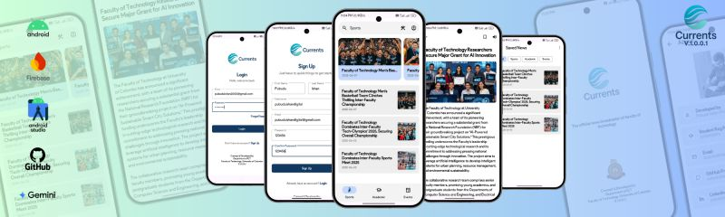
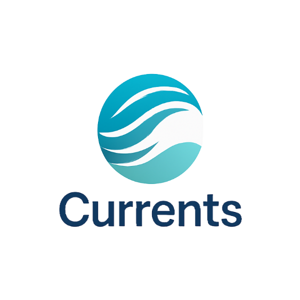
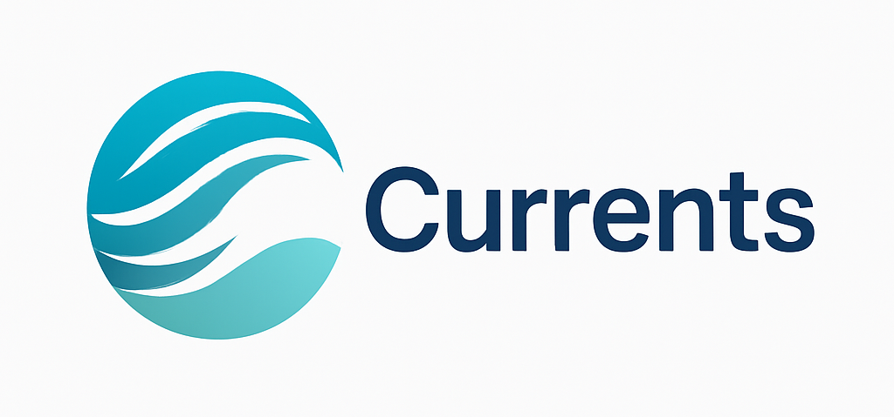
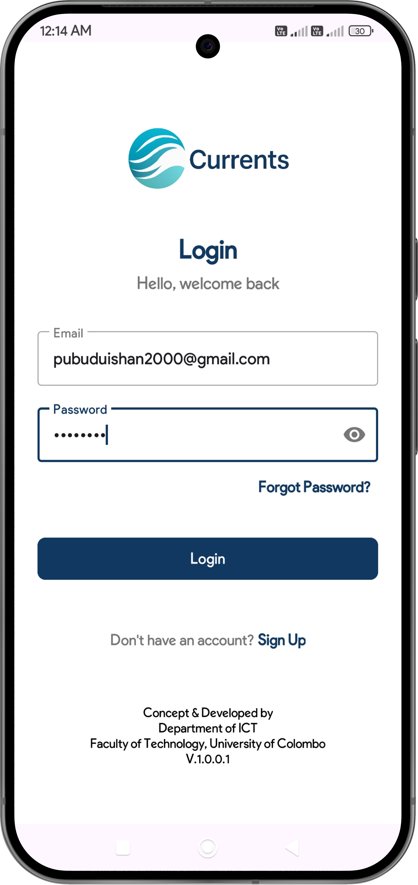
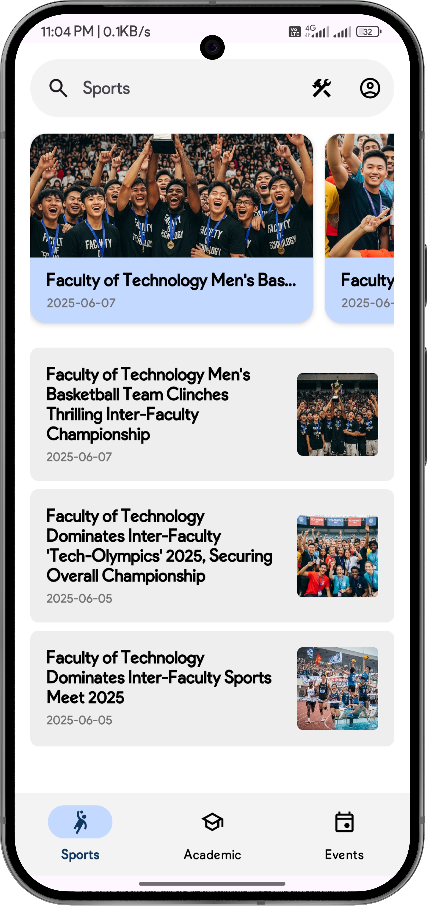
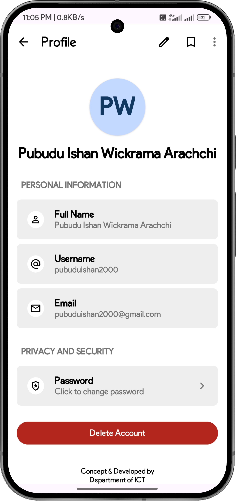

# Currents 📱
### Faculty News & Updates - Streamlined Communication Platform


[](https://github.com/your-username/currents/releases)
[](https://developer.android.com)
[](https://www.oracle.com/java/)
[](https://firebase.google.com)
[](LICENSE)

> A native Android application designed to centralize and streamline faculty-related updates, providing students and staff with real-time news delivery in an intuitive, categorized platform.

## 📰 App Logo  

| Vertical Logo | Horizontal Logo |
|---------------|-----------------|
|  |  |


## 📱 Screenshots  

| 🛡️ Login | ✍️ Sign Up | 🏠 Home |
|----------|------------|---------|
|  |  |  |

| 📰 Read News | 👤 Profile | 🔖 Bookmarks |
|--------------|------------|--------------|
|  |  |  |


## 🚩 Problem Statement

At the faculty level, students and staff often struggled to stay informed due to:
- Updates scattered across multiple channels (emails, notice boards, informal communications)
- Fragmented communication systems reducing engagement
- Missed opportunities due to delayed or overlooked announcements
- Lack of centralized information access

## ✅ Solution Overview

**Currents** addresses these challenges by providing a unified platform that:
- Aggregates all faculty-related announcements in one intuitive mobile interface
- Delivers real-time updates with categorized content organization
- Ensures no important update goes unnoticed through smart notification systems
- Enhances user experience with accessibility and personalization features

## 🔍 Key Features

### 👤 **User Management**
- Secure authentication and login system
- Personalized user profiles and preferences
- Role-based access control

### 📰 **Content Organization**
- **Categorized News Feed**: Filter by Sports, Academics, and Events
- **Real-Time Delivery**: Powered by Firebase Cloud Firestore
- **Smart Categorization**: Automated content sorting and tagging

### 🎯 **User Experience**
- **Text-to-Speech Integration**: Auditory access to news content
- **Bookmarking System**: Save and revisit important updates
- **Advanced Search & Filters**: Quickly find relevant information
- **Responsive Design**: Following Google Material 3 Design Guidelines


### 💬 **Engagement Tools**
- **User Feedback System**: Collect suggestions and ratings

## 🛠️ Technology Stack

| Category | Technology |
|----------|------------|
| **Design** | Figma, Material Design 3 |
| **Frontend** | Native Android (Java) |
| **IDE** | Android Studio |
| **Backend** | Firebase Suite |
| **Database** | Cloud Firestore |
| **Authentication** | Firebase Auth |
| **Storage** | Firebase Cloud Storage |
| **Version Control** | Git & GitHub |

## 📋 Prerequisites

Before running this project, ensure you have:

```bash
- Android Studio Arctic Fox or later
- Java Development Kit (JDK) 8 or higher
- Android SDK API 21 (Android 5.0) or higher
- Firebase account and project setup
- Git for version control
```

## 🚀 Installation & Setup

### 1. Clone the Repository
```bash
git clone https://github.com/your-username/currents.git
cd currents
```

### 2. Firebase Configuration
1. Create a new Firebase project at [Firebase Console](https://console.firebase.google.com)
2. Add your Android app to the Firebase project
3. Download the `google-services.json` file
4. Place it in the `app/` directory of your project

### 3. Enable Firebase Services
In your Firebase console, enable:
- **Authentication** (Email/Password)
- **Cloud Firestore** (Database)
- **Cloud Storage** (File storage)

### 4. Android Studio Setup
1. Open the project in Android Studio
2. Sync the project with Gradle files
3. Update SDK versions if prompted
4. Build and run the application

### 5. Database Structure (Cloud Firestore)
```javascript
users/
  ├── {userId}/
      ├── firstName: string
      ├── lastName: string
      ├── userName: string
      ├── email: string
      ├── createdAt: timestamp
      └── updatedAt: timestamp

articles/
  ├── {articleId}/
      ├── title: string
      ├── content: string
      ├── category: string (Sports|Academics|Events)
      ├── createdAt: timestamp
      └── imageUrl: string

bookmarks/
  ├── {bookmarkId}/
      ├── userId: string
      ├── articleId: string
      └── createdAt: timestamp

feedbacks/
  ├── {documentId}/
      ├── feedback: string
      ├── rating: number
      ├── createdBy: string
      └── createdAt: timestamp      

```

## 📱 App Architecture

```
📦 main
└── 📦 app
  ├── 🛠️ build
  ├── 📦 release
  └── 📂 main
      ├── 📂 java
      │   ├── 🎬 activity     # Activity lifecycle management
      │   ├── 📑 adapter      # RecyclerView / ViewPager adapters
      │   ├── 🧩 model        # Data models & entities
      │   └── 🎨 ui           # Custom UI (fragments, utils, services, firebase)
      │
      └── 🎨 res
          ├── 🎨 color        # color.xml
          ├── 🖼️ drawable     # images, vectors, shapes
          ├── 🏗️ layout       # XML UI layouts
          ├── ⚙️ values       # strings.xml, styles.xml, dimens.xml
          └── 🍔 menu         # app menus (menu.xml)

```


## 🗺️ Roadmap

- Push notifications for breaking news
- Dark mode implementation
- Offline reading capabilities
- Advanced search filters
- Multi-language support
- Social media integration
- Analytics dashboard
- Widget support
- iOS version development
- Web portal for admins
- AI-powered content recommendations
- Integration with university systems

## 📄 License

This project is licensed under the Apache-2.0 license - see the [LICENSE](LICENSE) file for details.

## 🙏 Acknowledgments

- Firebase team for excellent backend services
- Material Design team for UI/UX guidelines
- Android development community for continuous support
- Faculty members and students who provided valuable feedback


## 📄 Project Documents 

| 📌 Document           | 📂 Description                           | 🔗 Link |
|----------------------|-------------------------------------------|---------|
| 🎨 **Figma Design**  | UI/UX prototype of the Currents app       | [View Design](https://www.figma.com/design/xnnwbSx94NQcSHNADG8DQ2/Currents---A-News-App-by-FoT?node-id=0-1&t=stZel7fESMwnD4lV-1) |
| 📘 **UI Documentation** | Detailed documentation of app UI components | [Open Docs](https://drive.google.com/file/d/1AhwfrZdONjT09qnjQ7SShwrSh0sjLSKA/view?usp=drive_link) |
| 👤 **User Manual**   | Guide for end-users to navigate the app   | [Download Manual](https://drive.google.com/file/d/1SWa6ZTSuz4raJesYg75B9jFQkuUXx7x1/view?usp=drive_link) |


<br>
<br>

---

<div align="center">

✨ **All Rights Reserved © 2025** ✨  
Pubudu Ishan Wickrama Arachchi  

<p>
  <a href="https://facebook.com/pubuduishandigital"></a>
  <a href="https://linkedin.com/in/pubuduishandigital"></a>
  <a href="https://twitter.com/pubuduishandigi"></a>
  <a href="https://instagram.com/pubuduishandigital"></a>
  <a href="https://threads.com/pubuduishandigital"></a>
  <a href="https://www.reddit.com/user/pubuduishandigital/"></a>
  <a href="https://www.youtube.com/@pubuduishandigital"></a>
  <a href="https://www.pinterest.com/pubuduishandigital"></a>
  <a href="https://github.com/pubuduishandev"></a>
</p>

---

</div>
